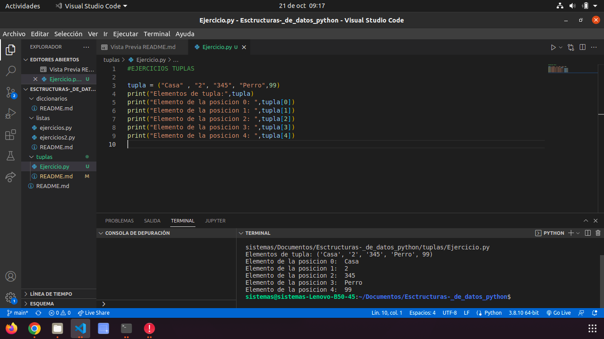
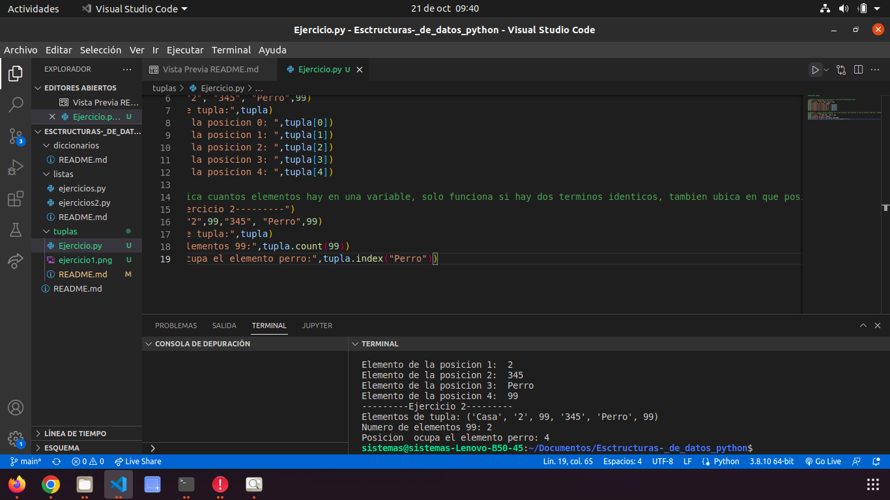
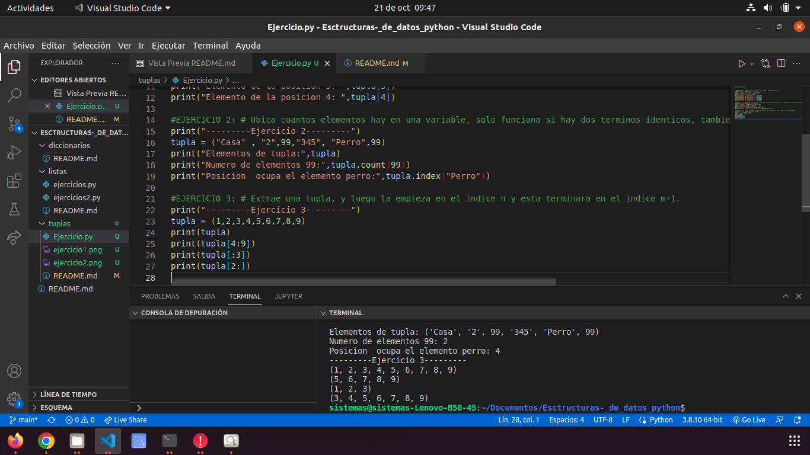
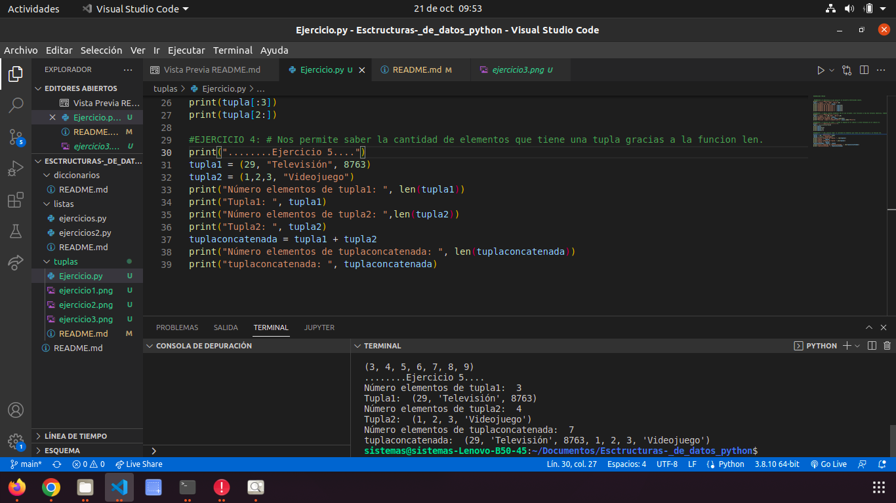
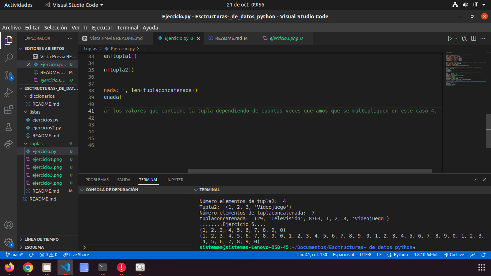

# Tuplas

- En este aparato vamos a hablar sobre los tipos de datos tuplas, que son un conjunto ordenado e inmutable de
elementos.
- La diferencia con las listas reside en que en las listas puedes maanipular los elementos y en las tuplas np,
es decir, no es posible añadir/eliminar elementos, modificado, etc.
- Al igual que las listas, las tuplas pueden contener elementos de diferentes tipos, por ejemplo una tupla
puede estar compuesta por cadenas de texo, por número enteros.etc.
- Las tuplas en Python se representan por una serie de elementos separados por comas y delimitados entre
paréntesisñ.

- Ejemplo:

`("Casa", "2", 345, "Perro", 99)`
- Las tuplas estaría compuestas por cinco elementos, las cadenas de texto "Casa", "2" y "Perro" y los números
enteros 345 y 99.
- Al igual que en las listas, los elemntos de las tuplas ocupan posiciones concretas, y mediante esa posición
que ocupan podemos acceder directamente a los elementos.
- En la siguiente tabla te mostramos la relación de cada elemento con posición que ocupa en la tabla:

|Elementos|Posición|
|---------|--------|
|"Casa"   |0       |
|"2"      |1       |
|345      |2       |  
|"Perro"  |3       |  
|99       |4       |

## EJERCICIO 1

## EJERCICIO 2

## EJERCICIO 3

## EJERCICIO 4

## EJERCICIO 5

